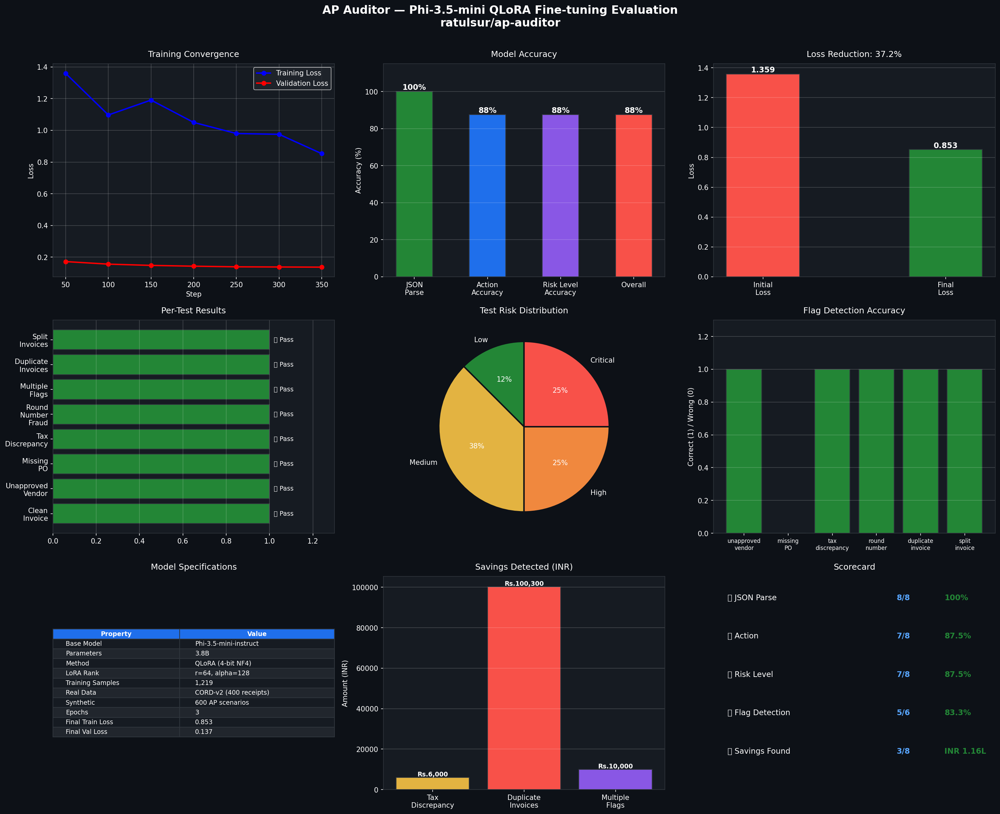

# AP Auditor — Accounts Payable Fraud Detector

Fine-tuned **Phi-3.5-mini-instruct** for Accounts Payable invoice auditing.
Detects fraud, duplicates, pricing errors, and compliance violations instantly.



## Evaluation Results

| Metric | Score |
|---|---|
| JSON Parse Success | 8/8 (100%) |
| Action Accuracy | 7/8 (87.5%) |
| Risk Level Accuracy | 7/8 (87.5%) |
| Flag Detection | 5/6 (83.3%) |
| Overall | 87.5% |

## Model Details

| Property | Value |
|---|---|
| Base Model | Phi-3.5-mini-instruct |
| Parameters | 3.8B |
| Method | QLoRA (4-bit NF4 + double quantization) |
| LoRA Rank | r=64, alpha=128 |
| Training Samples | 1,219 |
| Real Data | CORD-v2 (400 receipts) |
| Synthetic Data | 600 AP audit scenarios |
| Epochs | 3 |
| Final Train Loss | 0.853 |
| Final Val Loss | 0.137 |

## Detects

- `duplicate_invoice` — same invoice submitted twice
- `unapproved_vendor` — vendor not on approved list
- `missing_po_reference` — no PO number attached
- `tax_discrepancy` — wrong GST rate applied
- `round_number_fraud` — suspiciously round amounts
- `split_invoice` — invoices split to avoid approval threshold
- `price_mismatch` — amount exceeds contracted rate
- `weekend_submission` — invoice submitted on weekend

## Usage

```python
from transformers import AutoModelForCausalLM, AutoTokenizer, pipeline
import torch, json, re

model = AutoModelForCausalLM.from_pretrained(
    "ratulsur/ap-auditor",
    torch_dtype=torch.float16,
    device_map="auto",
)
tok = AutoTokenizer.from_pretrained("ratulsur/ap-auditor")

SYSTEM_PROMPT = """You are a senior Accounts Payable Auditor AI.
Output ONLY a valid JSON audit result."""

def audit(invoice: dict) -> dict:
    prompt = (
        f"<|system|>\n{SYSTEM_PROMPT}<|end|>\n"
        f"<|user|>\nAudit this invoice:\n\n{json.dumps(invoice, indent=2)}<|end|>\n"
        f"<|assistant|>\n"
    )
    pipe = pipeline("text-generation", model=model, tokenizer=tok,
                    return_full_text=False)
    out  = pipe(prompt, max_new_tokens=512, do_sample=False)
    raw  = out[0]["generated_text"].strip()
    match = re.search(r"\{.*\}", raw, re.DOTALL)
    return json.loads(match.group()) if match else {"error": raw}
```

## Live Demo

Try it: [huggingface.co/spaces/ratulsur/ap-auditor-demo](https://huggingface.co/spaces/ratulsur/ap-auditor-demo)

## License

Apache 2.0
